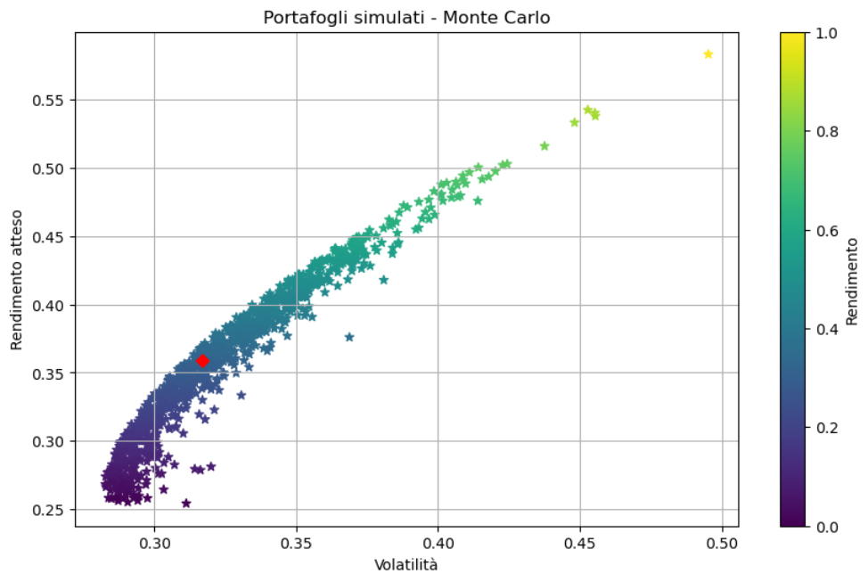
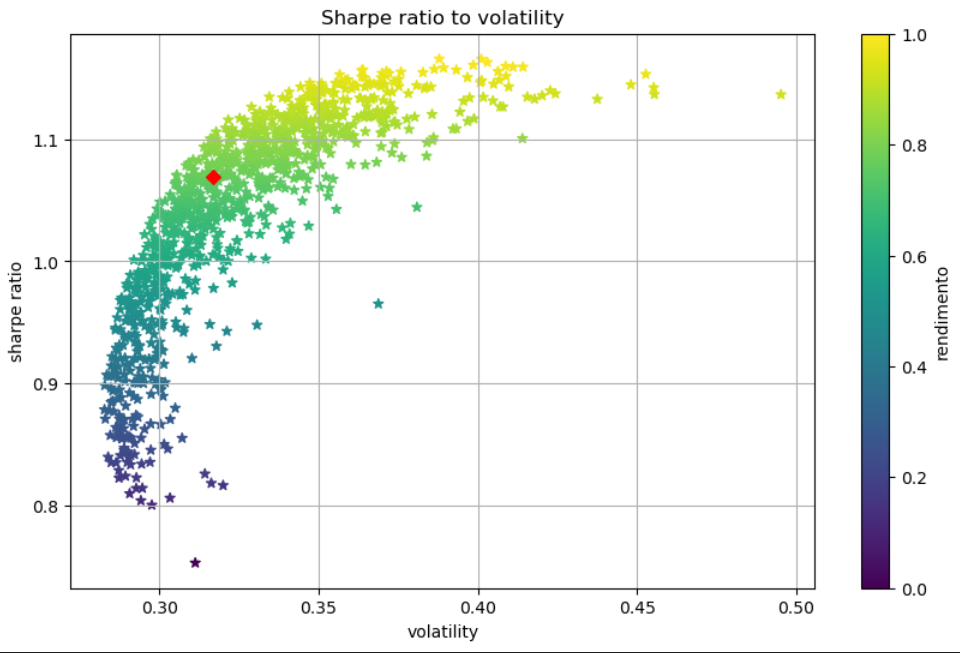

# Efficient Frontier - Analisi portafogli 

**Breve descrizione**

Questo repository contiene un Jupyter Notebook (`EfficientFrontier.ipynb`) che implementa un progetto di analisi di portafoglio in Python: download dei prezzi con `yfinance`, calcolo dei rendimenti, simulazione Monte Carlo di portafogli casuali, calcolo della frontiera efficiente (Markowitz) e visualizzazioni (scatter risk/return, heatmap di correlazione, frontiera).

---

## Cosa c'è in questo repository

* `EfficientFrontier.ipynb` — notebook principale (scarica dati, calcola statistiche, genera portafogli e plot)
* `requirements.txt` — elenco delle librerie Python necessarie
* `README.md` 
* `images' -cartella per le immagini

---

## Obiettivo del notebook

1. **Scarico dati**: uso `yfinance` per scaricare i prezzi storici per i tickers scelti.
2. **Pulizia & rendimenti**: calcolo rendimenti giornalieri con `pct_change()` e rimuovo i NaN; calcolo media dei rendimenti giornalieri e li annualizzo per ottenere una stima dei rendimenti attesi.
3. **Covarianza**: calcolo la matrice di covarianza dei rendimenti e la annualizzo. È la base per calcolare la varianza del portafoglio.
La differenza tra calcolare i rendimenti e la volatilità di un singolo titolo e di un portafoglio è che due o piu titolo possono essere correalti e quindi il semplice calcolo usato per i titoli non andrebbe a indicare il reale rischio del portafoglio. La formula $\sigma_p = \sqrt{w^T \Sigma w}$ tiene conto del rischio dei singoli titolo e delle loro correlazioni facendo il prodotto vettoriale.
4. **Generazione portafogli (Monte Carlo)**: genero 1000 set di pesi casuali (normalizzati in modo che sommino a 1), per ciascuno calcolo:

   * rendimento atteso del portafoglio: $\mu_p = w^T \mu$
   * volatilità del portafoglio: $\sigma_p = \sqrt{w^T \Sigma w}$
   * Sharpe ratio = ($\mu_p - r_f) / \sigma_p$ (per semplicità si può mettere `r_f = 0`,
   per praticità ho fissato tasso risk free al 2%)
5. **Visualizzazioni**: scatter risk vs return (nuvola di portafogli), evidenziazione del portafoglio a varianza minima e del portafoglio a Sharpe massimo.
6. **Output**: notebook produce grafici e un DataFrame riepilogativo (`Return`, `Volatility`, `Sharpe`, colonne `w_<TICKER>` per i pesi).

---

## Contenuto di `requirements.txt`

Nel file `requirements.txt` ho inserito le librerie minime necessarie al notebook

```
yfinance
pandas
numpy
matplotlib
random

```
---

### Download dei dati storici

```

tickers = ["AAPL", "MSFT", "GOOG", ...]
data = yf.download(tickers, start="YYYY-MM-DD", end="YYYY-MM-DD")["Adj Close"]

```

---

### Caclolo rendimmenti giornalieri , annualizati e la matrice di covarianza annualizzata

```

## calcolo i rendimenti giornalieri dei singoli titoli  
returns = data.pct_change().dropna() 

#rendimenti annualizzati dei singoli titoli 
mean_returns = returns.mean() * 252

#calcolo matrice covarianza annualizzata
cov_matrix = returns.cov() * 252


```
---

### Genero 1000 portafogli con pesi casuali e per ognugno calcolo rendimento, rischio e sharpratio

```
weights = np.random.random(len(tickers))  
weights /= np.sum(weights)  

MUp = np.dot(weights, mean_returns)
DEVp = np.sqrt(weights.T @ cov_matrix @ weights)

sharpe = (MUp - rf)/DEVp


```
---
### Estraggo ritorni e volatilità dei portafogli e li plotto 

```

returns = [p[0] for p in portafogli]
volatility = [p[1] for p in portafogli]


plt.figure(figsize=(10,6))
plt.scatter(volatility, returns, c=returns, cmap='viridis', marker='*')
plt.xlabel('Volatilità')
plt.ylabel('Rendimento atteso')
plt.title('Portafogli simulati - Monte Carlo')
plt.colorbar(label='Rendimento')
plt.grid(True)
plt.show()
```


## Esempio risultato efficient frontier

Ecco un esempio della simulazione Monte Carlo dei portafogli:




## Esempio risultato per sharp ratio


	


##Creazione e confronto di un portafolgio equally weighted


## Considerazioni


